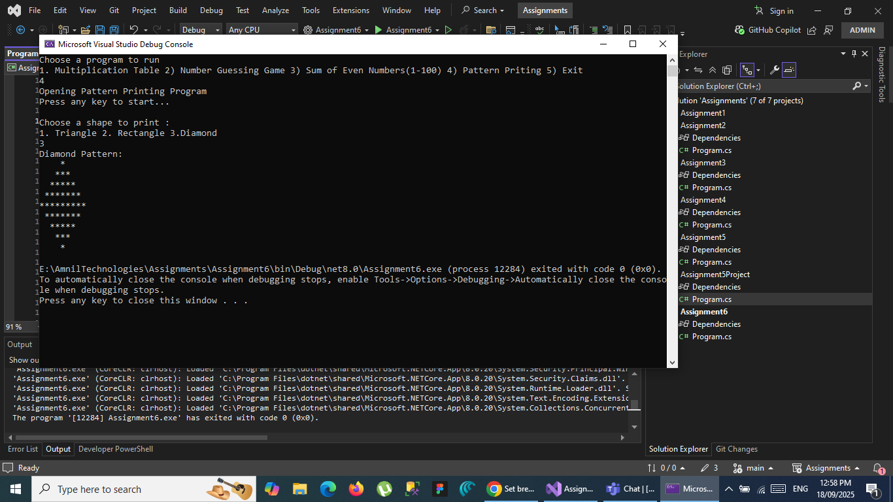

# Screenshots

[Assignment1 Screenshot](#Assignment1)
[Assignment2 Screenshot](#Assignment2)
[Assignment3 Screenshot](#Assignment3)
[Assignment4 Screenshot](#Assignment4)
[Assignment5 Screenshot](#Assignment5)
[Assignment5 Project](#Assignment5Project)
[Assignment6 Screenshot](#Assignment6)
[Assignment7 Screenshot](#Assignment7)
[Assignment8 Screenshot](#Assignment8)
[Assignment9 Screenshot](#Assignment9)
[Assignment10 Screenshot](#Assignment10)
[Assignment11 Screenshot](#Assignment11)
[Assignment12 Screenshot](#Assignment12)
[Assignment13 Screenshot](#Assignment13)
[Assignment14 Screenshot](#Assignment14)
[InterfacePresentation Screenshot](#Interface)

## Assignment1
* 

## Assignment2
* 

## Assignment3
* 

## Assignment4
* 
* 
* 
* 
* 

## Assignment5
* 
* 

## Assignment5Project
* 

## Assignment6
* 
* 
* 
* 

## Assignment7
* 
* 
* 

## Assignment8
* 
* 
* 

## Assignment9
* 
* 

## Assignment10
* 

## Assignment11
* 

## Asssignment12
* 

## Assignment13
* 

## Assignment14
* 

## Interface
* 