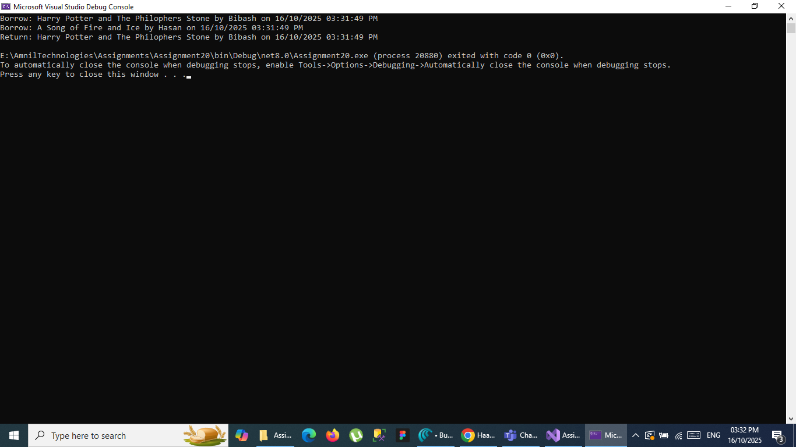
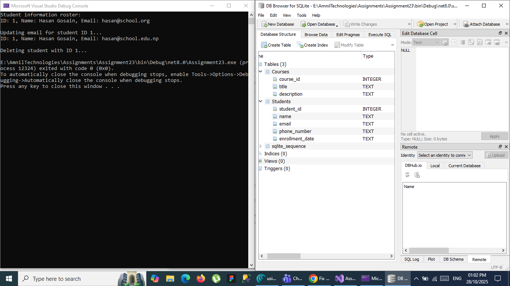
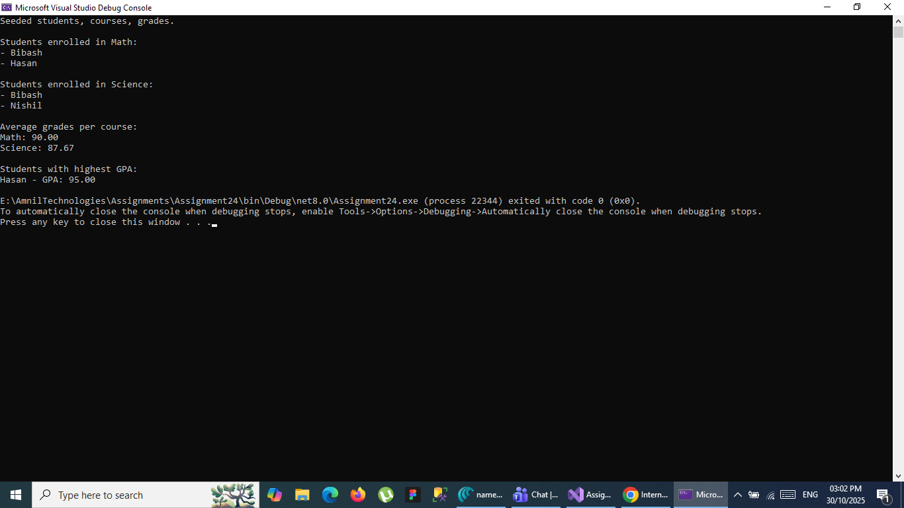

# Screenshots

[Assignment1 Screenshot](#Assignment1)
[Assignment2 Screenshot](#Assignment2)
[Assignment3 Screenshot](#Assignment3)
[Assignment4 Screenshot](#Assignment4)
[Assignment5 Screenshot](#Assignment5)
[Assignment5 Project](#Assignment5Project)
[Assignment6 Screenshot](#Assignment6)
[Assignment7 Screenshot](#Assignment7)
[Assignment8 Screenshot](#Assignment8)
[Assignment9 Screenshot](#Assignment9)
[Assignment10 Screenshot](#Assignment10)
[Assignment11 Screenshot](#Assignment11)
[Assignment12 Screenshot](#Assignment12)
[Assigment12 Refactored](#Assignment12R)
[Assignment13 Screenshot](#Assignment13)
[Assignment14 Screenshot](#Assignment14)
[InterfacePresentation Screenshot](#Interface)
[Assignment15 Screenshot](#Assigment15)
[Assignment15 Project](#Assigment15Project)
[Assignment16 Screenshot](#Assignment16)
[Assignment17 Screenshot](#Assignment17)
[CustomException Screenshot](#CustomException)
[Assignment18 Screenshot](#Assignment18)
[Assignment19 Screenshot](#Assignment19)
[Assignment20 Screenshot](#Assignment20)
[Assignment21 Screenshot](#Assignment21)
[Assignment22: StudentRecordSystem Screenshot](#Assignment22StudentRecordSystem)
[Assignment22: ProductInventorySystem Screenshot](#Assignment22ProductInventorySystem)
[Assignment23](#Assignment23)
[Assignment24](#Assignment24)
[Assignment25](#Assignment25)
[Assignment26](#Assignment26)

## Assignment1
* 

## Assignment2
* 

## Assignment3
* 

## Assignment4
* 
* 
* 
* 
* 

## Assignment5
* 
* 

## Assignment5Project
* 

## Assignment6
* 
* 
* 
* 

## Assignment7
* 
* 
* 

## Assignment8
* 
* 
* 

## Assignment9
* 
* 

## Assignment10
* 

## Assignment11
* 

## Asssignment12
* 

## Assignment13
* 

## Assignment14
* 

## Interface
* 

## Assignment15
* 

## Assigment15Project
* 

## Assignment16
* 

## Assignment12R
* 

## Asssignment17
* 

## CustomException
* 

## Assignment 18
* 

## Assignment 19
* 

## Assignment20
* 

## Assignment21
* 

## Assignment22StudentRecordSystem
* 

## Assignment22ProductInventorySystem
* 

## Assignment23
* 

## Assignment24
* 

## Assignment25
* 

## Asssignment26
* 